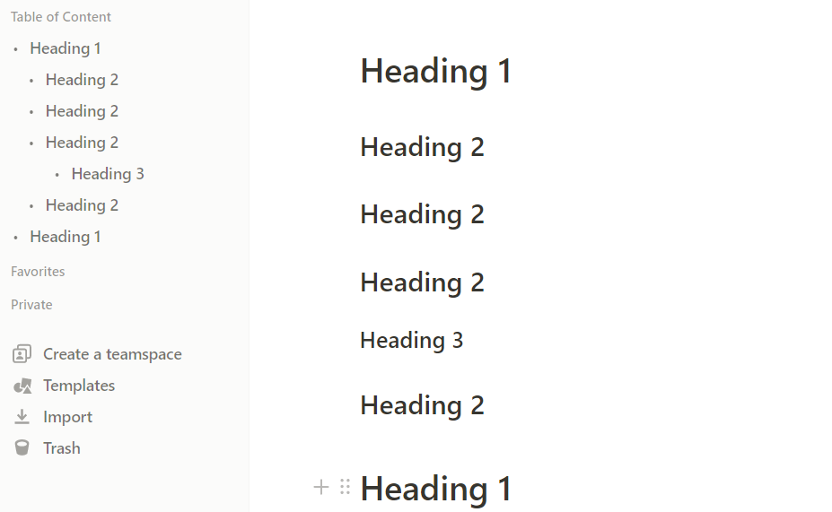

# Notion ToC Sidebar

Browser extension for Showing Table of Contents on sidebar on Notion Web.

## Features
- Show Table of Contens(toc) on sidebar
- Reload toc automatically
- Jump to clicked heading block
- Toggle visibility of toc

## Installation

1. clone/download this repository from GitHub
   - Clone: `git clone https://github.com/moxak/NotionToCSidebar.git`
   - Download: **code** > **Donwload ZIP**
2. Open the Extension Management page by navigating to `chrome://extensions`.
3. Enable Developer Mode by clicking the toggle switch next to **Developer mode**.
4. Click the **LOAD UNPACKED** button and select the unpacked directory named `NotionToCSidebar`.